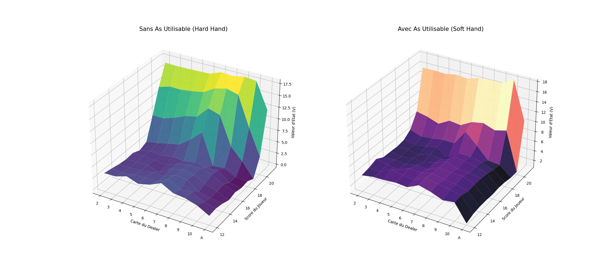
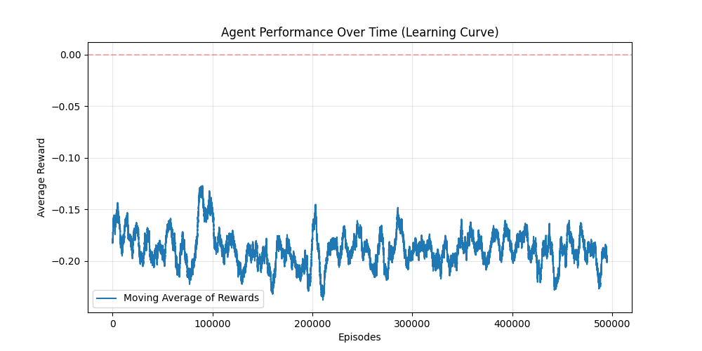
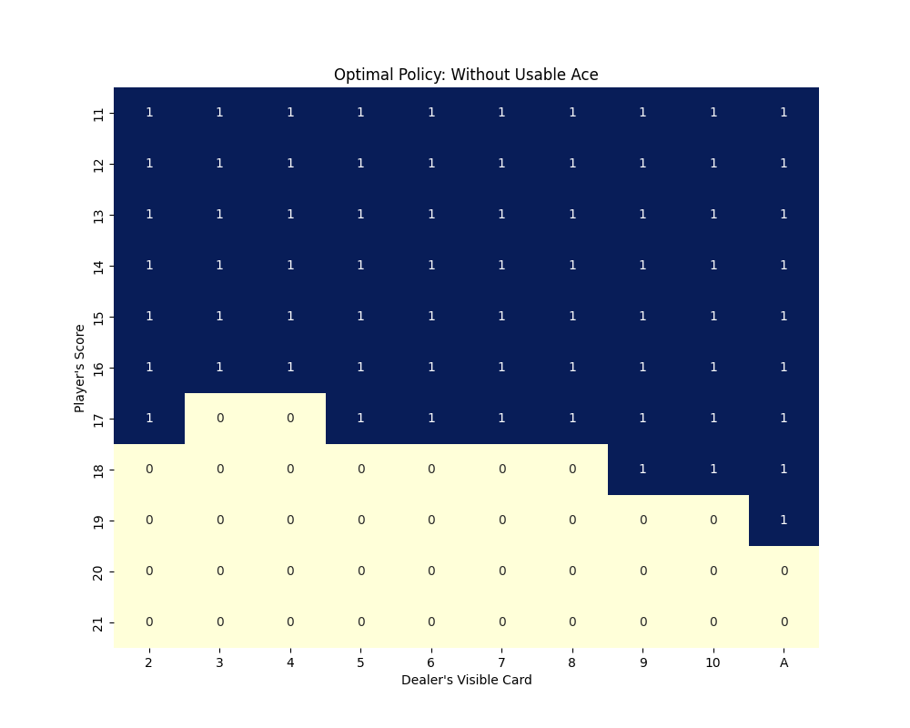
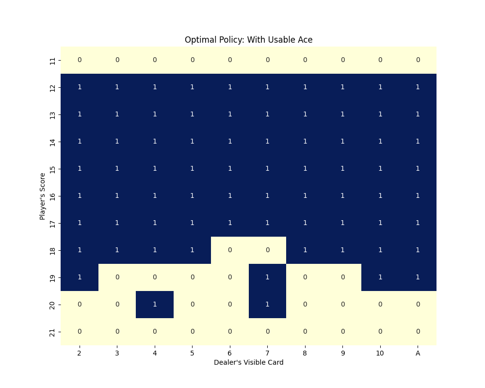

  

# Blackjack Reinforcement Learning (Q-Learning)

This project implements a **Reinforcement Learning (RL) agent** that learns to play Blackjack from scratch. Instead of using a pre-made environment like OpenAI Gymnasium, I developed a **custom, standard-compliant environment** to demonstrate full mastery of Markov Decision Processes (MDP) and game logic.

## Project Overview

The goal was to create an agent capable of discovering the "Basic Strategy" of Blackjack through trial and error. By simulating hundreds of thousands of games, the agent populates a **Q-Table**, mapping game states to the most profitable actions (Hit or Stand).

### Key Features

* **Custom Environment:** A robust Python implementation of Blackjack rules, including Ace management and dealer AI.
* **Q-Learning Algorithm:** Implementation of the Bellman Equation with **Epsilon-Greedy** exploration and **Learning Rate Decay**.
* **Advanced Analytics:** Professional visualization suite using Seaborn and Matplotlib, featuring 2D Policy Heatmaps and 3D Value Function surfaces.

---

## Technical Implementation

### 1. State Space Modeling

To optimize convergence, the environment discretizes the game into a triplet state:
`(Player Score, Dealer Upcard, Usable Ace)`
This reduces millions of card combinations into approximately **280 relevant states**, allowing the Q-Table to converge efficiently.

### 2. The Learning Strategy

The agent uses a **Decaying Epsilon-Greedy** policy:

* **Exploration:** High initial Epsilon ($\epsilon = 1.0$) to discover the reward landscape.
* **Exploitation:** Gradual decay to $\epsilon = 0.01$ to solidify optimal moves.
* **Stability:** A decaying Learning Rate ($\alpha$) ensures that late-game outliers do not corrupt established Q-values.

---

## Results & Analysis

### Learning Curve

The agent shows a clear upward trend in average rewards, plateauing as it masters the game logic. The final reward stability near the theoretical house edge proves the agent has reached a near-optimal policy.

  

### Strategy Heatmaps

The heatmaps show the agent's decision boundaries.

* **Hard Totals:** The agent correctly identifies "Bust cards" for the dealer and stands on low totals (13-16).
* **Soft Totals:** The agent shows increased aggression when holding a "Usable Ace," leveraging the lower risk of busting.

  
  

### 3D Value Function

This visualization shows the "Reward Topography." The peaks at score 21 and the valleys at 14–16 (against a Dealer 10/Ace) illustrate that the agent has a high-fidelity understanding of winning and losing probabilities across all game scenarios.